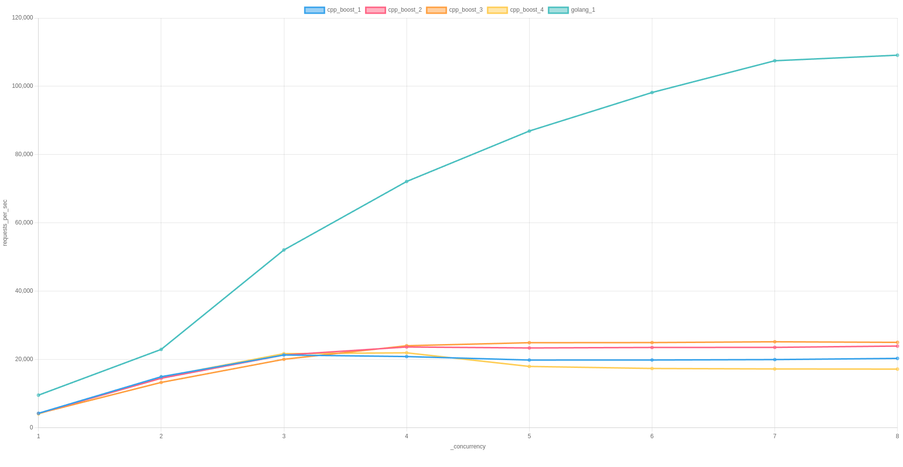

# README

The purpose of this repo is to benchmark
different HTTP libraries available to Golang and C++.

## Test Implementations

The following descriptions of each of the test implementations all of which produce a static server binary.

* [cpp_boost_1](./cpp_boost_1/)
  * Language: C++
  * Libraries: Boost v1.85.0
  * Modified from the [Boost Beast Small HTTP Server Example](https://github.com/boostorg/beast/blob/boost-1.85.0/example/http/server/small/http_server_small.cpp)
* [cpp_boost_2](./cpp_boost_2/)
  * Language: C++
  * Libraries: Boost v1.85.0
  * Modified from the [Boost Beast Small HTTP Server Example](https://github.com/boostorg/beast/blob/boost-1.85.0/example/http/server/small/http_server_small.cpp)
  * Removed the deadline, the idea here was that perhaps the deadline is slowing things down.
* [cpp_boost_3](./cpp_boost_3/)
  * Language: C++
  * Libraries: Boost v1.85.0
  * Modified from the [Boost Beast Small HTTP Server Example](https://github.com/boostorg/beast/blob/boost-1.85.0/example/http/server/small/http_server_small.cpp)
  * Removed the deadline, the idea here was that perhaps the deadline is slowing things down.
  * Set keep_alive to true
* [cpp_boost_4](./cpp_boost_4/)
  * Language: C++
  * Libraries: Boost v1.85.0
  * Modified from the [Boost Beast Fast HTTP Server Example](https://github.com/boostorg/beast/blob/boost-1.85.0/example/http/server/fast/http_server_fast.cpp)
  * Removed the deadline, the idea here was that perhaps the deadline is slowing things down.
  * Set keep_alive to true
* [golang_1](./golang-1/)
  * Language: Golang
  * Libraries: Standard `net/http` core library.

A note about implementation naming convention: as you can see we do not incorporate the name of "core" libraries, or libraries that come with the language, into the name of the implementation.

## Common Usage and Endpoints

We want each of the implementations to have the same command-line interface, so exactly the same flags/arguments.
Here is the common usage interface for each of the implementations:

```
Usage of <path/to/executable>:
  -addr string
        The listening address (default "127.0.0.1")
  -port int
        The listening port (default 3535)

```

Each server implementations must respond 200 to the `/time` endpoint with the following
template of an output:
```
<html>
<head><title>Current time</title></head>
<body>
<h1>Current time</h1>
<p>The current time is ${seconds} seconds since the epoch.</p>
</body>
</html>
```

This was selected in order to match one of the endpoints in the Boost Beat v1.85.0 Small HTTP Example.
It exercises dynamic string concatenation, or templating, which
is common for HTTP application servers.

## Test Tools

[Go-Wrk](https://github.com/tsliwowicz/go-wrk) is a clone of the popular HTTP benchmarking tool Wrk.
To install it run:
```
go install github.com/tsliwowicz/go-wrk@latest
```

All of the scripts here using `go-wrk` as the HTTP bencharking tool, and they expect `go-wrk` to be available on your path.

## Results

What follows are results specific to my development machine.
We encourage you to run your own benchmarks on your own machine.



On the x-axis we have increasing client concurrency, which is the `-c` flag for `go-wrk`.

On the y-axis we are plotting the number requests per second over a 5 second test duration, reported by `go-wrk`.

These tests are not run at the same time, they are run sequentially so that each server has the full run of the test machine.
Once again, we encourage you to run your own benchmarks.

Note: I have done a build of the Boost Asio/Beast server with the server's "concurrency hint" set to higher numbers, and the results were approximately the same. 

## Running The Tests Yourself

### Requirements

* Boost v1.85.0
* Ruby >= v3.2.1
* Rake >= v13.1.0

### Steps

* Make sure you have Boost v1.85.0 installed on some known path.
* Configure the file `c_cpp_properties.json` in each of the implementation directories. For an example of how this file is structured see the file `c_cpp_properties.json.sample`
* Run `rake bench` -- this will run the benchmark and generate a graph
  in the `./report` directory.